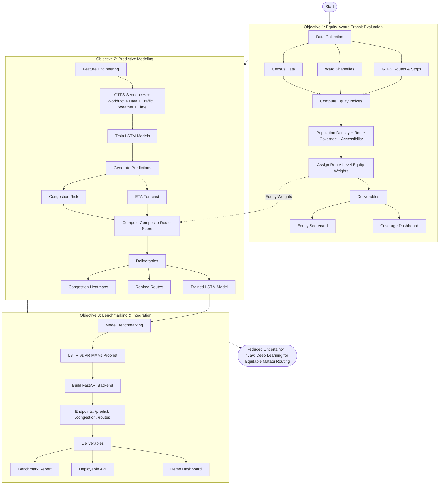

# Jav: Deep Learning for Equitable Matatu Routing in Nairobi's Informal Transit Networks

> **Jav** (shengh for *Matatu*) is a deep learning project exploring how AI can make Nairobi’s informal public transit system more **efficient**, **predictable**, and **equitable**.  
> It focuses on **ETA prediction**, **congestion mapping**, and **route performance ranking** using open transport data.

## Overview

In Nairobi, matatus serve as the dominant form of public transport, used by approximately 48–58% of daily commuters, or an estimated 1.5–3.5 million people. Despite their central role in city mobility, the system remains largely informal and uncoordinated, leading to frequent congestion, unreliable travel times, and inequitable service distribution across neighborhoods.

**Jav** seeks to leverage **deep learning + geospatial analytics** to predict travel times (ETAs) and highlight underserved routes, improving both commuter experience and policy planning.

* **Focus**: ETA forecasting (target MAE <5 mins), congestion mapping, and route performance ranking.
* **Stack**: PyTorch/TensorFlow (DL), FastAPI (API), GeoPandas (geospatial data), and OSMnx (routing), Supabase/Postgres (DB).
* **Goal**: Reduce commuter uncertainty, time savings and identify underserved routes for more equitable urban mobility.

## Problem Statement

Nairobi’s 135+ matatu routes lack standardized schedules or predictive travel time data.  
A 10 km trip can take over **78 minutes**, especially during peak congestion in low-income areas like **Kibera** or **Pipeline**.  

While commercial transit apps exist, none integrate **machine learning-based ETA forecasts** using live data (traffic, weather, route topology) or **equity metrics** for underserved regions.

## Objectives

| **Objective**                                                                                                          | **Key Activities**                                                                                                                                                                                                                                                                                | **Dependencies / Inputs**                                                                     | **Deliverables & Metrics**                                                                                     |
| ---------------------------------------------------------------------------------------------------------------------- | ------------------------------------------------------------------------------------------------------------------------------------------------------------------------------------------------------------------------------------------------------------------------------------------------- | --------------------------------------------------------------------------------------------- | -------------------------------------------------------------------------------------------------------------- |
| **1. Equity-Aware Transit Evaluation**<br>*(Foundation: Fair service assessment)*                                      | - Define and implement fairness metrics (e.g., underserved route weighting by population density and access gaps).<br>- Fuse GTFS coverage data with socio-economic and accessibility layers (wards, census) to quantify transit equity.                                                          | - GTFS data (routes, stops).<br>- Socio-economic & spatial datasets (Kenya wards shapefiles). | - **Equity Scorecard** (Gini-like index ≥ 0.7).<br>- **Interactive dashboard** highlighting underserved zones. |
| **2. Predictive Modeling for ETA, Congestion & Route Ranking**<br>*(Core: Context-aware forecasting & prioritization)* | - Train **LSTM-based ETA models**, combining GTFS schedules with real-time traffic and weather features.<br>- Predict congestion likelihood and route reliability using historical delays and equity weights.<br>- Compute a **composite route score** (ETA variance + equity-adjusted coverage). | - Obj. 1 equity metrics.<br>- APIs: Traffic (Google Maps), Weather (OpenWeather).             | - **Trained LSTM model** (MAPE < 15 %).<br>- **Congestion heatmaps** & ranked route list.                      |
| **3. Benchmarking & Integration**<br>*(Validation & Deployment)*                                                       | - Compare model performance against **ARIMA** and **Prophet** baselines.<br>- Develop **FastAPI backend** exposing ETA predictions, congestion forecasts, and equity-adjusted rankings.                                                                                                           | - Obj. 2 model outputs.<br>- Historical GTFS logs for testing.                                | - **Benchmark report** (LSTM ≥ 20 % more reliable).<br>- **Deployable API** (Dockerized with Swagger docs).    |

* Prototype a **FastAPI backend** for predictions and route ranking (future integration).

## File Structure

```
.
├── data
│   ├── raw/                        # Raw downloads (GTFS, CSVs, PBF)
│   └── processed/                  # Cleaned tensors/CSVs (e.g., seqs.parquet)
│
├── notebooks/                      # Jupyter notebooks for EDA, training
│   ├── 01_gtfs_eda.ipynb           # Parse GTFS & explore stop sequences
│   ├── 02_feature_engineering.ipynb# Merge traffic & weather features
│   └── 03_model_lstm.ipynb         # LSTM training + evaluation
│
├── scripts/
│   ├── fetch_gtfs.py               # Download Digital Matatus GTFS
│   ├── preprocess_data.py          # Clean & prepare route/traffic/weather
│   └── train_model.py              # Script-based model training
│
├── server/                         # Placeholder for FastAPI backend (later phase)
│   └── app/
│       └── main.py                 # (Future) endpoints /routes, /predict
│
├── docs/
│   ├── proposal.md                 # White paper
│   ├── architecture.md             # Methodology, system design
│   └── results.md                  # Performance metrics, bias audit
│
├── requirements.txt
├── README.md
└── .gitignore
```

## Data Sources

| Source | Description | Format |
|--------|--------------|---------|
| [Digital Matatus GTFS](https://digitalmatatus.com/data) | Route, stop, and shape data | GTFS (TXT) |
| [WorldMove website](https://fi.ee.tsinghua.edu.cn/worldmove/data) | Large-scale synthetic mobility dataset | ASSORTED |
| [OpenWeatherMap API](https://openweathermap.org/history) | Weather features | JSON |
| [OpenStreetMap (Geofabrik Kenya)](https://download.geofabrik.de/africa/kenya.html) | Road network topology | PBF |


## Methodology

### **Objective 1 — Equity-Aware Transit Evaluation**

**Foundation:** Ensure fair and inclusive transit service assessment.

* Compute **ward-level equity indices** using population density, route coverage, and accessibility metrics.
* Assign **route-level equity weights** by intersecting GTFS routes with ward boundaries, prioritizing underserved zones.
* Integrate these weights into route scoring to encourage service expansion where it’s most needed.

**Deliverables:**
Equity scorecards and interactive dashboards highlighting coverage gaps and underserved communities.

### **Objective 2 — Predictive Modeling for ETA, Congestion & Route Ranking**

**Core Engine:** Context-aware forecasting and prioritization.

* Train **LSTM models** on GTFS stop sequences enriched with **WorldMove mobility data**, traffic density, weather patterns, and temporal features to predict **ETA** and **congestion risk**.
* Compute a **composite route score** that balances travel reliability, congestion probability, and equity weight.
* Visualize congestion hotspots and route performance under varying conditions.

**Deliverables:**
Trained predictive models, congestion heatmaps, and ranked route lists adjusted for social equity.

### **Objective 3 — Benchmarking & Integration**

**Validation & Scale:** Transition from prototype to production.

* Benchmark LSTM model performance against **ARIMA** and **Prophet** baselines for accuracy and temporal stability.
* Develop a **FastAPI backend** to serve predictions, congestion forecasts, and equity-adjusted route rankings in real time.
* Integrate outputs into a **demo dashboard** for visualization and policy insight.



**Deliverables:**
Benchmark report, deployable API, and interactive visualization dashboard.

### Setup

```bash
git clone git@github.com:atlonglastkibet/jav-nairobi.git
cd jav-nairobi
pip install -r requirements.txt
jupyter notebook
```

## License

MIT License – see [LICENSE](LICENSE).

## Acknowledgments

* Digital Matatus & University of Nairobi GTFS Project
* WorldMove datasets
* OpenWeatherMap & OSM for open APIs