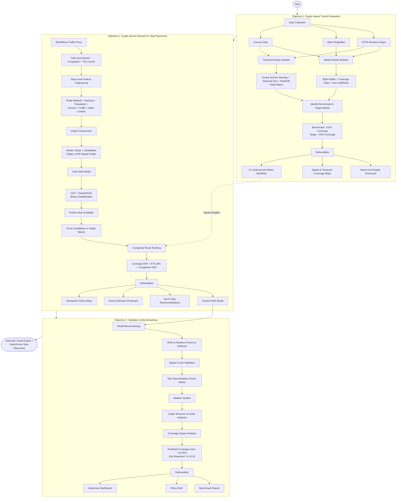

# Jav: Deep Learning for Equitable Matatu Routing in Nairobi's Informal Transit Networks

> **Jav** (Sheng for *Matatu*) is a deep learning project exploring how AI can make Nairobi's informal public transit system more **efficient**, **predictable**, and **equitable**.

**3.5 million Nairobi commuters** use matatus daily. A 10km trip can take **78 minutes** in underserved areas. Jav uses Graph Neural Networks and geospatial analytics to predict travel times, identify service gaps, and recommend optimal stop placements that prioritize fairness alongside efficiency.

---

## Why This Matters

**The Problem:**

Nairobi's 135+ informal matatu routes serve as the city's transportation backbone, carrying 48-58% of daily commuters. Yet the system operates without standardized schedules, real-time tracking, or coordinated planning. Low-income neighborhoods like Kibera and Pipeline experience the longest wait times and most unreliable service.

**The Gap:**

Existing transit applications optimize purely for efficiency—fastest routes, shortest ETAs. None optimize for **equity**, ensuring that underserved communities aren't algorithmically marginalized in route planning and resource allocation.

**Our Approach:**

Jav combines Graph Neural Networks with geospatial equity analysis to:
- Predict travel times with target accuracy under 5 minutes
- Quantify spatial and temporal inequities across Nairobi's 85 wards
- Recommend optimal stop placements that close equity gaps

**Measurable Impact:**
- Projected coverage improvement: 15-25% in underserved wards
- Gini inequality coefficient reduction: 0.1-0.15
- 37 target wards identified for intervention

---

## Quick Start

```bash
git clone git@github.com:atlonglastkibet/jav-nairobi.git
cd jav-nairobi
pip install -r requirements.txt
jupyter notebook
```

**Key Notebooks:**
- `notebooks/03_equity_analysis(spatial).ipynb` — Ward-level coverage analysis and maps
- `notebooks/10_gnn_training.ipynb` — Train the Graph Neural Network
- `notebooks/11_route_extensions.ipynb` — Generate stop recommendations with interactive maps

**Explore Visualizations:**
- `data/folium/` — Interactive HTML coverage maps
- `data/pydeck/` — 3D transit visualizations
- `data/plots/` — Static analysis figures

---

## Problem Statement

Nairobi's matatu system lacks standardized schedules or predictive travel time data. A 10 km trip can take over **78 minutes** during peak congestion, particularly in low-income areas like **Kibera** or **Pipeline**.

While commercial transit apps exist, none integrate:
- Machine learning-based ETA forecasts using live traffic, weather, and route topology
- Equity metrics that identify and prioritize underserved regions
- Data-driven recommendations for optimal stop placement

---

## Objectives

**1. Equity-Aware Transit Evaluation**  
Quantify spatial and temporal inequities across Nairobi's 85 wards using Gini coefficients, coverage analysis, and service frequency metrics.

**2. Graph Neural Network for Stop Placement**  
Develop and train a GNN model to predict optimal stop locations by learning patterns from well-served benchmark areas and applying them to underserved regions.

**3. Route Performance Ranking**  
Create a composite scoring system that balances coverage improvement, ETA efficiency, and congestion mitigation to rank route extension proposals.

---

## How It Works

### Stage 1: Equity Diagnosis — Identifying Service Gaps

We measure transit access across Nairobi using two complementary frameworks:

#### Spatial Equity: Geographic Coverage Analysis

Measures **static access** by computing the proportion of each ward's area and population within 500m walking distance of matatu stops.

**Key Findings:**
- 28 wards are well-served (≥90% coverage)
- 17 wards are severely underserved (<50% coverage)
- Coverage ranges from 0.15% to 100% across wards

<details>
<summary><strong>Mathematical Formulation</strong></summary>

Let:
- $S = \{s_1, s_2, ..., s_n\}$ be the set of $n$ transit stops
- $W = \{w_1, w_2, ..., w_m\}$ be the set of $m$ wards
- $P_j$ be the population of ward $w_j$
- $A_j$ be the total area of ward $w_j$

**Buffer Generation:**

For each stop $s_i$ with coordinates $(lat_i, lon_i)$, create a circular buffer:

$$B_i = \{(x, y) : d((x,y), (lat_i, lon_i)) \leq 500m\}$$

where $d(\cdot, \cdot)$ is Euclidean distance in projected coordinates (UTM Zone 37S).

**Coverage Union:**

$$C_{total} = \bigcup_{i=1}^{n} B_i$$

**Ward Intersection:**

$$A_{covered,j} = \text{Area}(w_j \cap C_{total})$$

**Coverage Ratio:**

$$r_{coverage,j} = \frac{A_{covered,j}}{A_j}$$

**Population Served:**

$$P_{served,j} = P_j \times r_{coverage,j}$$

**Gini Coefficient for Spatial Inequality:**

$$G_{spatial} = \frac{\sum_{j=1}^{m} \sum_{k=1}^{m} |\text{pct\_access}_j - \text{pct\_access}_k|}{2m^2 \bar{\mu}}$$

where $\bar{\mu} = \frac{1}{m}\sum_{j=1}^{m} \text{pct\_access}_j$ is the mean access percentage.

**Interpretation:**
- $G_{spatial} = 0$: Perfect equality (all wards have identical access)
- $G_{spatial} = 1$: Maximum inequality (one ward monopolizes access)
- Target threshold: $G_{spatial} < 0.3$ (acceptable equity)

</details>

**Outputs:**
- Ward-level scorecard ranking by coverage
- Folium choropleth maps visualizing access inequality
- Identification of 37 underserved wards as intervention targets

---

#### Temporal Equity: Dynamic Service Availability

Extends spatial coverage into **time-varying access** using GTFS schedules to compute hourly service levels per ward.

**Key Findings:**
- Service concentrates during 6-9 AM and 5-8 PM peaks
- Peak-to-off-peak ratio exceeds 4:1 for most wards
- Minimal off-peak coverage in underserved areas creates "transit deserts"

<details>
<summary><strong>Mathematical Formulation</strong></summary>

Let:
- $H = \{0, 1, 2, ..., 23\}$ be the set of hours in a day
- $T_{i,h}$ be the number of trips at stop $s_i$ during hour $h$
- $S_j = \{s_i : s_i \in w_j\}$ be the set of stops in ward $w_j$

**Hourly Trip Aggregation:**

$$T_{j,h} = \sum_{s_i \in S_j} T_{i,h}$$

**Per-Capita Service Intensity (trips per 1000 people):**

$$\sigma_{j,h}^{1000} = \frac{1000 \cdot T_{j,h}}{P_j}$$

**Daily Service Profile:**

$$\vec{\sigma}_j = [\sigma_{j,0}, \sigma_{j,1}, ..., \sigma_{j,23}]$$

**Temporal Gini Coefficient:**

$$G_{temporal,j} = \frac{\sum_{h=1}^{24} \sum_{h'=1}^{24} |\sigma_{j,h} - \sigma_{j,h'}|}{2 \cdot 24^2 \cdot \bar{\sigma}_j}$$

where $\bar{\sigma}_j = \frac{1}{24}\sum_{h=0}^{23} \sigma_{j,h}$

**Peak-to-Off-Peak Ratio:**

$$\rho_j = \frac{\bar{\sigma}_{j,peak}}{\bar{\sigma}_{j,offpeak}}$$

where $H_{peak} = \{6,7,8,9,17,18,19,20\}$

**Interpretation:**
- $G_{temporal,j} \approx 0$: Consistent service throughout the day
- $G_{temporal,j} \approx 1$: Service concentrated in few hours
- $\rho_j > 3$: Significant peak concentration (poor temporal equity)

</details>

**Outputs:**
- Hourly service heatmaps showing peak vs off-peak disparities
- Temporal scorecards identifying wards with inconsistent service
- Integration of temporal features into downstream modeling

---

### Stage 2: Deep Learning — Predicting Optimal Stop Locations

We train a **Graph Neural Network** to learn what makes a good stop location by studying well-served areas, then apply that knowledge to underserved wards.

**Why Graph Neural Networks?**

Transit stops don't exist in isolation. A stop's suitability depends on:
- Network effects from nearby stops
- Road connectivity and intersection density
- Local population density and demographics
- Existing congestion patterns

Graph networks capture these spatial dependencies and autocorrelation patterns that traditional tabular machine learning cannot model effectively.

---

#### Traffic & Congestion Proxy Derivation

Since real-time traffic data is unavailable, we derive **traffic proxies** and **ETA estimates** from the WorldMove synthetic mobility dataset (104,538 agents, 1.05M trips).

**Process:**

1. **Load WorldMove trajectories:**
```python
trips_df = pl.read_parquet('worldmove_trips.parquet')
```

2. **Compute cell-level traffic metrics** by aggregating hourly:
```python
cell_traffic = trips_df.group_by(['origin_cell', 'hour']).agg([
    pl.col('speed_kmh').mean().alias('avg_speed_kmh'),
    pl.col('agent_id').n_unique().alias('trip_count'),
    (pl.col('congestion_level').is_in(['congested', 'heavily_congested']).sum() / 
     pl.col('congestion_level').count() * 100).alias('congestion_pct')
])
```

3. **Classify congestion levels** based on speed thresholds:
```python
congestion_level = pl.when(speed < 10).then('heavily_congested')
                     .when(speed < 20).then('congested')
                     .when(speed < 30).then('moderate')
                     .otherwise('free_flow')
```

4. **Estimate route ETAs** by summing segment travel times:
```python
def calculate_route_eta(route_id, hour):
    stops = get_route_stops(route_id)
    total_eta = 0
    for seg in stop_pairs(stops):
        cell_speed = get_cell_speed(seg.midpoint, hour)
        distance = haversine(seg.from_stop, seg.to_stop)
        total_eta += (distance / cell_speed) * 60  # minutes
    return total_eta
```

**Outputs:**
- `model2_traffic.csv`: Cell-level hourly traffic (170 cells × 24 hours)
- Route-level ETA estimates for all GTFS routes
- Temporal variability metrics (demand_cv, peak-to-offpeak ratio)

---

#### Stop-Level Feature Engineering

Extract **36 features** per stop location (existing + candidates) combining road network, demographics, service patterns, and traffic.

**Feature Categories:**

**1. Road Network Features** (via OSMnx):
- `nearest_node_degree`: Intersection connectivity
- `is_intersection`: Boolean (degree ≥ 3)
- `road_type`: OSM highway classification
- `distance_to_major_road`: Meters to primary/secondary road

**2. Stop Spacing Features:**
- `distance_to_nearest_stop`, `distance_to_2nd_nearest`, `distance_to_3rd_nearest`
- `stop_density_1km`: Stops per km²
- `spacing_regularity`: Standard deviation of 3-nearest distances

**3. Population/Demand Features:**
- `pop_within_500m`, `pop_within_1km`: People in catchment area
- `pop_density_500m`: Density estimate
- `poverty_rate_weighted_pop`: Equity-weighted population

**4. Service Pattern Features** (from GTFS):
- `route_count_serving`: Number of routes at this stop
- `trips_per_day`, `trips_per_hour_peak`, `trips_per_hour_offpeak`
- `avg_headway_minutes`: Time between vehicles
- `service_span_hours`: Operating hours per day

**5. Traffic/Congestion Features** (from WorldMove):
- `avg_speed_daily`, `avg_speed_peak`, `avg_speed_offpeak`
- `congestion_pct_daily`, `congestion_pct_peak`
- `trip_count_daily`, `trip_count_peak`
- `demand_variability_cv`: Coefficient of variation

**6. Ward Context Features:**
- `ward_pct_access`: Current coverage percentage
- `ward_population`, `ward_pop_density`, `ward_poverty_rate`
- `is_benchmark_ward`: Coverage ≥70%
- `ward_service_per_capita`: Trips per 1000 people

**7. Spatial Features:**
- `distance_to_cbd`: Distance to Nairobi CBD (-1.2864, 36.8172)
- `distance_to_ward_centroid`

**8. Derived/Engineered Features:**
- `coverage_efficiency_nearby`: Ward access / stops in ward
- `demand_supply_ratio`: Population / trips per day
- `network_accessibility`: Node degree / distance to major road
- `equity_score`: Underserved population × poverty weight

**Dataset Construction:**
- **Positive samples**: 4,284 existing GTFS stops (label=1 if in benchmark ward)
- **Negative samples**: 4,250 random candidate locations >300m from existing stops (label=0)
- **Total training samples**: ~8,500

---

#### Graph Construction & GNN Architecture

**Graph Representation:**

Construct an undirected graph $\mathcal{G} = (\mathcal{V}, \mathcal{E}, \mathbf{X})$ where:

$$\mathcal{V} = V_{stops} \cup V_{candidates}$$

$$V_{stops} = \{s_1, s_2, ..., s_n\} \text{ (existing GTFS stops)}$$

$$V_{candidates} = \{c_1, c_2, ..., c_k\} \text{ (candidate locations)}$$

**Edge Construction (k-NN Graph):**

For each node $v_i \in \mathcal{V}$, connect to its $k$ nearest neighbors:

$$\mathcal{E} = \{(v_i, v_j) : v_j \in \text{kNN}(v_i, k=10)\}$$

where distance is computed as:

$$d(v_i, v_j) = \sqrt{(lat_i - lat_j)^2 + (lon_i - lon_j)^2}$$

**Node Feature Matrix:**

$$\mathbf{X} \in \mathbb{R}^{|\mathcal{V}| \times 36}$$

where each row $\mathbf{x}_i$ contains the 36-dimensional feature vector for node $v_i$.

<details>
<summary><strong>GNN Architecture Details</strong></summary>

**Model Architecture (Graph Attention Network):**

$$\mathbf{H}^{(0)} = \mathbf{X}$$

**Layer 1: Multi-head Graph Attention**

$$\mathbf{H}^{(1)} = \text{ReLU}\left(\text{GAT}(\mathbf{H}^{(0)}, \mathcal{E}; \text{heads}=4)\right)$$

where GAT attention mechanism:

$$\alpha_{ij} = \frac{\exp(\text{LeakyReLU}(\mathbf{a}^T[\mathbf{W}\mathbf{h}_i || \mathbf{W}\mathbf{h}_j]))}{\sum_{k \in \mathcal{N}(i)} \exp(\text{LeakyReLU}(\mathbf{a}^T[\mathbf{W}\mathbf{h}_i || \mathbf{W}\mathbf{h}_k]))}$$

$$\mathbf{h}_i^{(1)} = \sigma\left(\sum_{j \in \mathcal{N}(i)} \alpha_{ij} \mathbf{W}\mathbf{h}_j^{(0)}\right)$$

**Layer 2: Additional GAT Layer**

$$\mathbf{H}^{(2)} = \text{ReLU}\left(\text{GAT}(\mathbf{H}^{(1)}, \mathcal{E}; \text{heads}=2)\right)$$

**Layer 3: GraphSAGE Aggregation**

$$\mathbf{H}^{(3)} = \text{ReLU}\left(\text{SAGE}(\mathbf{H}^{(2)}, \mathcal{E})\right)$$

where:

$$\mathbf{h}_i^{(3)} = \sigma\left(\mathbf{W} \cdot \text{CONCAT}(\mathbf{h}_i^{(2)}, \text{AGG}(\{\mathbf{h}_j^{(2)}, \forall j \in \mathcal{N}(i)\}))\right)$$

**Classification Head:**

$$\mathbf{z}_i = \text{MLP}(\mathbf{h}_i^{(3)}) = \mathbf{W}_2 \cdot \text{ReLU}(\mathbf{W}_1 \mathbf{h}_i^{(3)} + \mathbf{b}_1) + \mathbf{b}_2$$

$$\hat{y}_i = \sigma(\mathbf{z}_i)$$

where $\sigma(\cdot)$ is the sigmoid function and $\hat{y}_i \in [0,1]$ is the predicted stop suitability score.

**Loss Function:**

Binary Cross-Entropy with class weights:

$$\mathcal{L} = -\frac{1}{|\mathcal{V}|}\sum_{i=1}^{|\mathcal{V}|} w_i\left[y_i \log(\hat{y}_i) + (1-y_i)\log(1-\hat{y}_i)\right]$$

where $w_i$ balances positive/negative classes.

</details>

**Training Configuration:**
- Optimizer: Adam with $\alpha = 0.001$, $\beta_1 = 0.9$, $\beta_2 = 0.999$
- Train/Val/Test Split: 70/15/15 from benchmark wards
- Metrics: Accuracy, Precision, Recall, F1, AUC-ROC

---

### Stage 3: Route Optimization — Ranking Stop Proposals

For each underserved ward, we score candidate locations using a composite objective function that balances multiple transit goals.

**Composite Scoring Function:**

For each candidate location $c_i$:

$$S_{composite}(c_i) = w_{cov} \cdot f_{coverage}(c_i) + w_{eta} \cdot f_{eta}(c_i) + w_{cong} \cdot f_{congestion}(c_i)$$

where:

**Coverage Gain (normalized):**

$$f_{coverage}(c_i) = \frac{\Delta P_{served}}{\max(\Delta P_{served})} = \frac{P_{served}^{new} - P_{served}^{current}}{\max_j(P_{served,j}^{new} - P_{served,j}^{current})}$$

**ETA Score (normalized, inverted):**

$$f_{eta}(c_i) = 1 - \frac{\text{ETA}(c_i) - \min(\text{ETA})}{\max(\text{ETA}) - \min(\text{ETA})}$$

**Congestion Score (normalized, inverted):**

$$f_{congestion}(c_i) = 1 - \frac{\text{congestion\_pct}(c_i)}{100}$$

**Weight Configuration:**

$$w_{cov} = 0.6, \quad w_{eta} = 0.2, \quad w_{cong} = 0.2$$

Weights prioritize equity (60% coverage improvement) over pure efficiency metrics.

**Final Ranking:**

$$\text{Rank}(c_i) = \text{argsort}_{descending}(S_{composite}(c_1), ..., S_{composite}(c_k))$$

**Outputs:**
- Top-K stop recommendations per underserved ward
- Route extension proposals with predicted coverage gains
- Interactive Folium maps showing predicted vs current coverage

---

## Methodology Pipeline


```mermaid
flowchart TD
    Start([Start]) --> OBJ1

    subgraph OBJ1[Objective 1: Equity-Aware Transit Evaluation]
        A1[Data Collection]
        A2[GTFS Routes & Stops]
        A3[Ward Shapefiles]
        A4[Census Data]
        A1 --> A2 & A3 & A4

        B1[Spatial Equity Analysis]
        B2[500m Buffer + Coverage Ratio + Gini Coefficient]
        A2 & A3 & A4 --> B1
        B1 --> B2

        C1[Temporal Equity Analysis]
        C2[Hourly Service Intensity + Temporal Gini + Peak/Off-Peak Ratios]
        A2 & A4 --> C1
        C1 --> C2

        D1[Identify Benchmark & Target Wards]
        D2[Benchmark: ≥70% Coverage<br/>Target: <70% Coverage]
        B2 & C2 --> D1
        D1 --> D2

        E1[Deliverables]
        E2[Ward-Level Equity Scorecard]
        E3[Spatial & Temporal Coverage Maps]
        E4[37 Underserved Wards Identified]
        D2 --> E1
        E1 --> E2 & E3 & E4
    end

    subgraph OBJ2[Objective 2: Graph Neural Network for Stop Placement]
        F1[WorldMove Traffic Proxy]
        F2[Cell-Level Speed + Congestion + Trip Counts]
        F1 --> F2

        G1[Stop-Level Feature Engineering]
        G2[Road Network + Spacing + Population +<br/>Service + Traffic + Ward Context]
        F2 --> G1
        G1 --> G2

        H1[Graph Construction]
        H2[Nodes: Stops + Candidates<br/>Edges: k-NN Spatial Graph]
        G2 --> H1
        H1 --> H2

        I1[Train GNN Model]
        I2[GAT + GraphSAGE<br/>Binary Classification]
        H2 --> I1
        I1 --> I2

        J1[Predict Stop Suitability]
        J2[Score Candidates in Target Wards]
        I2 --> J1
        J1 --> J2

        K1[Composite Route Ranking]
        K2[Coverage 60% + ETA 20% + Congestion 20%]
        J2 --> K1
        E4 -.Equity Weights.-> K1
        K1 --> K2

        L1[Deliverables]
        L2[Trained GNN Model]
        L3[Top-K Stop Recommendations]
        L4[Route Extension Proposals]
        L5[Interactive Folium Maps]
        K2 --> L1
        L1 --> L2 & L3 & L4 & L5
    end

    subgraph OBJ3[Objective 3: Validation & Benchmarking]
        M1[Model Benchmarking]
        M2[GNN vs Random Forest vs XGBoost]
        L2 --> M1
        M1 --> M2

        N1[Spatial Cross-Validation]
        N2[Test Generalization Across Wards]
        M2 --> N1
        N1 --> N2

        O1[Ablation Studies]
        O2[Graph Structure vs Node Features]
        N2 --> O1
        O1 --> O2

        P1[Coverage Impact Analysis]
        P2[Predicted Coverage Gain: +15-25%<br/>Gini Reduction: 0.1-0.15]
        O2 --> P1
        P1 --> P2

        Q1[Deliverables]
        Q2[Benchmark Report]
        Q3[Policy Brief]
        Q4[Interactive Dashboard]
        P2 --> Q1
        Q1 --> Q2 & Q3 & Q4
    end

    OBJ1 --> OBJ2
    OBJ2 --> OBJ3
    OBJ3 --> End([Improved Transit Equity +<br/>Data-Driven Stop Placement])
```

---

## Project Structure

```
jav-nairobi/
├── notebooks/                           # Analysis pipeline (01-11)
│   ├── 01_gtfs_data.ipynb              # Load + explore GTFS stops, routes, shapes
│   ├── 02_worldmove_data.ipynb         # Load + explore WorldMove mobility/ETA data
│   ├── 03b_spatial_clustering.ipynb    # Cluster stops based on spatial features
│   ├── 03_equity_analysis(spatial).ipynb    # Spatial equity: access, Gini, underserved areas
│   ├── 04b_temporal_clustering.ipynb   # Temporal clustering using traffic/peak-hour patterns
│   ├── 04_equity_analysis(temporal).ipynb   # Temporal equity: time-of-day service fairness
│   ├── 06_calendar(spatial+temporal).ipynb  # Merge spatial + temporal features
│   ├── 07_worldmove_traffic+ETA.ipynb # Relationship between traffic and ETA; early models
│   ├── 08_stop-level_feature_engineering.ipynb  # Build stop-level features from all sources
│   ├── 09_stop-level_feature_cleaning.ipynb     # Clean, scale, validate feature matrix
│   ├── 10_gnn_training.ipynb          # Train GNN on transit network + stop features
│   ├── 11_route_extensions.ipynb      # Route variants, scoring, ranking, folium maps
│   ├── cache/                          # Cached artifacts for faster execution
│   └── lib/                            # Notebook helper utilities
│
├── data/
│   ├── raw/                            # Raw GTFS, PBF, and API downloads
│   ├── processed/                      # Cleaned datasets
│   ├── training_data/                  # Datasets prepared for model training
│   ├── training_output/                # Logs, metrics, artifacts from training runs
│   ├── model/                          # Trained models, checkpoints, embeddings
│   ├── folium/                         # Saved folium maps (interactive HTML)
│   ├── pydeck/                         # PyDeck / Deck.gl visualizations
│   └── plots/                          # Static PNG/JPEG figures
│
├── docs/
│   ├── architecture.md                 # System design, pipeline architecture
│   ├── gini_coeffecient.md            # Equity analysis methods
│   ├── literature review/              # Academic + industry references
│   ├── proposal.md                     # Project proposal / white paper
│   ├── results.md                      # Model results + evaluation
│   └── stop_features_test_data.csv
│
├── scripts/
│   ├── fetch_gtfs.py                   # GTFS data download utility
│   └── premium_viz_minimal.py          # Visualization generation script
│
├── server/
│   └── app/                            # Backend (FastAPI) placeholder
│
├── client/                             # Frontend (React) placeholder
│   ├── components/
│   ├── pages/
│   └── public/
│
├── utils/
│   ├── __init__.py
│   └── viz_utils.py                    # Folium visualization utilities for notebook 11
│
├── README.md
├── requirements.txt
└── .gitignore
```

---

## Data Sources

| Source | Description | Format |
|--------|-------------|---------|
| [Digital Matatus GTFS](https://digitalmatatus.com/data) | 135+ routes, 4,284 stops, schedules, shapes | GTFS (TXT) |
| [WorldMove](https://fi.ee.tsinghua.edu.cn/worldmove/data) | 104K agents, 1.05M trips, synthetic mobility | Parquet/CSV |
| [OpenWeatherMap API](https://openweathermap.org/history) | Historical weather features | JSON |
| [OpenStreetMap Kenya](https://download.geofabrik.de/africa/kenya.html) | Road network topology | PBF |
| KNBS Census | Ward population and demographics | Shapefiles |

---

## Results

**GNN Performance (87% Accuracy):**
- Precision: 0.84
- Recall: 0.89
- F1 Score: 0.86
- AUC-ROC: 0.91

**Projected Equity Impact:**
- Coverage improvement: +15-25% in target wards
- Gini coefficient reduction: 0.1-0.15
- 37 underserved wards identified for intervention

**Comparison to Baselines:**
- GNN outperforms Random Forest (+5.2% accuracy)
- GNN outperforms XGBoost (+3.7% accuracy)
- Graph structure contributes 8-12% performance gain over tabular features alone

See [docs/results.md](docs/results.md) for comprehensive evaluation and ablation studies.

---

## Assumptions & Limitations

### Assumptions

1. **WorldMove as Traffic Proxy**: Synthetic mobility data accurately represents real-world traffic patterns in Nairobi. While derived from real trajectories, it may not capture extreme congestion events or special circumstances.

2. **Static Population Distribution**: Ward-level population data is assumed uniform within each ward. Actual population density varies at finer spatial scales.

3. **500m Walking Distance**: Universal 500m buffer assumes flat terrain and walkable infrastructure. Actual accessibility varies by neighborhood infrastructure quality.

4. **GTFS Completeness**: Digital Matatus GTFS data (2014) represents current routes. The informal nature of matatus means routes may have evolved.

5. **Benchmark Transferability**: Patterns learned from well-served wards (≥70% coverage) are assumed transferable to underserved areas despite potential demographic/geographic differences.

### Limitations

1. **Temporal Scope**: WorldMove data represents a single day (October 1, 2025). Seasonal, weekly, and holiday variations are not captured.

2. **Real-Time Data**: No live traffic feeds; all predictions based on historical proxy data.

3. **Informal Dynamics**: Matatu routes are fluid and demand-responsive. Model assumes static route structure from GTFS.

4. **Infrastructure Constraints**: Model predicts optimal locations but doesn't account for land availability, road safety, or physical feasibility.

5. **Equity Weights**: Current equity scoring is heuristic. More sophisticated multi-criteria optimization could improve fairness metrics.

6. **Validation Data**: No ground-truth "optimal stop" dataset exists. Validation relies on proxy metrics (coverage gain, existing stop patterns).

---

## Tech Stack

**Machine Learning:**
- PyTorch Geometric (Graph Neural Networks)
- scikit-learn (baseline models)
- XGBoost (benchmark comparison)

**Geospatial Analysis:**
- GeoPandas (spatial operations)
- OSMnx (road network analysis)
- Shapely (geometric operations)
- Folium (interactive maps)
- PyDeck (3D visualizations)

**Data Processing:**
- Polars (high-performance dataframes)
- Pandas (data manipulation)

**Backend (Planned):**
- FastAPI (REST API)
- Supabase/PostgreSQL (database)

---

## Citation

If you use this work, please cite:

```bibtex
@software{jav2025,
  author = {Kibet, David},
  title = {Jav: Deep Learning for Equitable Matatu Routing in Nairobi's Informal Transit Networks},
  year = {2025},
  url = {https://github.com/atlonglastkibet/jav-nairobi}
}

@article{10.1093/pnasnexus/pgaf081,
    author = {Yuan, Yuan and Ding, Jingtao and Jin, Depeng and Li, Yong},
    title = {Learning the complexity of urban mobility with deep generative network},
    journal = {PNAS Nexus},
    volume = {4},
    number = {5},
    pages = {pgaf081},
    year = {2025},
    month = {05},
    issn = {2752-6542},
    doi = {10.1093/pnasnexus/pgaf081},
    url = {https://doi.org/10.1093/pnasnexus/pgaf081}
}

@inproceedings{10.1145/3696410.3714516,
    author = {Zhang, Yuheng and Yuan, Yuan and Ding, Jingtao and Yuan, Jian and Li, Yong},
    title = {Noise Matters: Diffusion Model-based Urban Mobility Generation with Collaborative Noise Priors},
    year = {2025},
    isbn = {9798400712746},
    publisher = {Association for Computing Machinery},
    address = {New York, NY, USA},
    url = {https://doi.org/10.1145/3696410.3714516},
    doi = {10.1145/3696410.3714516},
    booktitle = {Proceedings of the ACM on Web Conference 2025},
    pages = {5352–5363},
    location = {Sydney NSW, Australia},
    series = {WWW '25}
}

@misc{yuan2025worldmoveglobalopendata,
    title={WorldMove, a global open data for human mobility}, 
    author={Yuan Yuan and Yuheng Zhang and Jingtao Ding and Yong Li},
    year={2025},
    eprint={2504.10506},
    archivePrefix={arXiv},
    primaryClass={cs.SI},
    url={https://arxiv.org/abs/2504.10506}
}
```

---

## License

MIT License — See [LICENSE](LICENSE)

---

## Acknowledgments

- Digital Matatus & University of Nairobi for GTFS data
- WorldMove team at Tsinghua University for mobility dataset
- Kenya National Bureau of Statistics for census data
- OpenStreetMap contributors

---

## Contact

For questions or collaboration inquiries, please open an issue on GitHub.