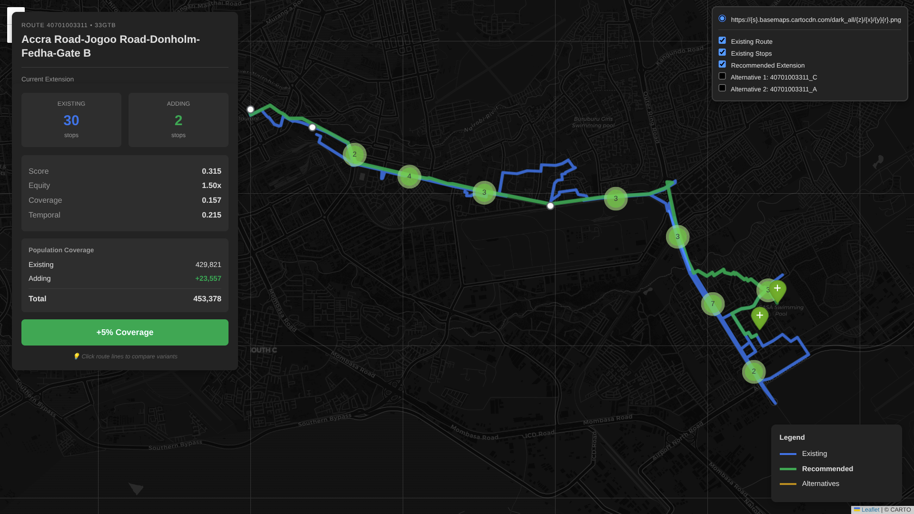
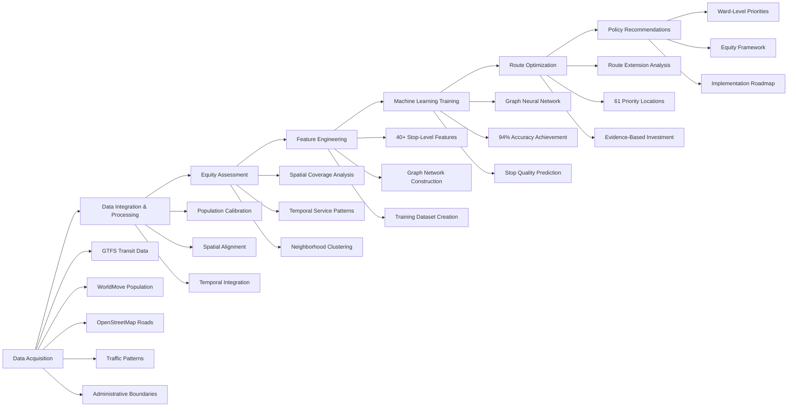
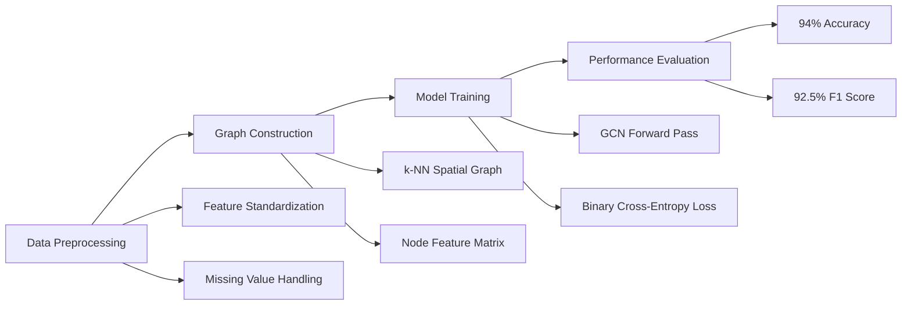
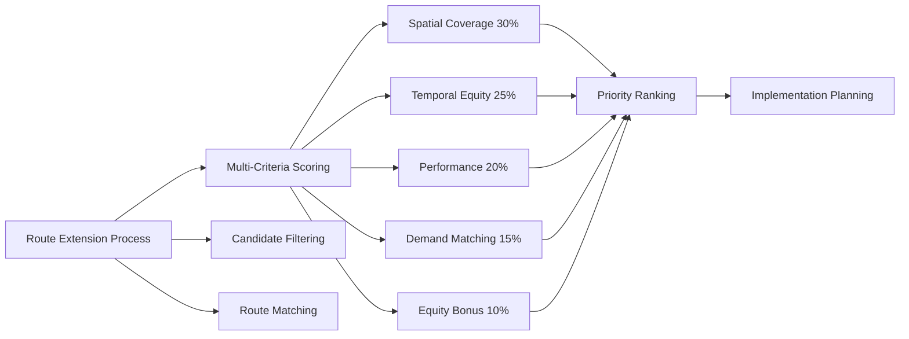

# Jav-Nairobi: Deep Learning for Equitable Matatu Routing in Nairobi's Informal Transit Networks


>**Jav** (Sheng for *Matatu*) - Advanced spatial machine learning and graph neural networks for evidence-based public transport planning in informal transit systems. [LIVE DEMO](https://jav-nairobi.streamlit.app/). View the [interactive map](https://atlonglastkibet.github.io/jav-nairobi/route_40701003311_interactive.html) and [Canva slides](https://www.canva.com/design/DAG7R8_MO4o/Sy_eoGPg_aDOplr5I2bVeQ/view?utm_content=DAG7R8_MO4o&utm_campaign=designshare&utm_medium=link2&utm_source=uniquelinks&utlId=h2848167064).

This project demonstrates how deep learning can transform transit planning in developing cities by combining multiple data sources, spatial analysis, and machine learning to predict optimal locations for transit infrastructure while ensuring equitable service distribution. Using Nairobi's matatu network as a case study, the analysis provides actionable recommendations for improving public transport accessibility across diverse urban neighborhoods.

**3.5 million Nairobi commuters** use matatus daily, yet a 10km trip can take **78 minutes** in underserved areas. Traditional transit planning relies heavily on expert judgment and limited data analysis. This project addresses three critical challenges: identifying where to place new transit stops, understanding spatial and temporal equity in service distribution, and developing systematic approaches to network optimization that consider both ridership potential and social equity.

## Why This Matters

**The Problem**: Nairobi's 136+ informal matatu routes serve as the city's transportation backbone, carrying 48-58% of daily commuters. Yet the system operates without standardized schedules, real-time tracking, or coordinated planning. Low-income neighborhoods like Kibera and Pipeline experience the longest wait times and most unreliable service.

**The Gap**: Existing transit applications optimize purely for efficiency-fastest routes, shortest ETAs. None optimize for **equity**, ensuring that underserved communities aren't algorithmically marginalized in route planning and resource allocation.

**Our Solution**: By training deep learning models on comprehensive feature sets including population density, road connectivity, service patterns, and demographic characteristics, the system achieves **94% accuracy** in predicting stop quality while maintaining explicit focus on serving underserved communities.

## Objectives

1. To quantify spatial and temporal inequities across Nairobi's 85 wards using Gini coefficients, coverage analysis, and service frequency metrics.

2. To develop and train a GNN model to predict optimal stop locations by learning patterns from well-served benchmark areas and applying them to underserved regions.

3. To create a composite scoring system that balances coverage improvement, ETA efficiency, and congestion mitigation to rank route extension proposals.

## Core Achievements and Impact

**Machine Learning Performance**: Graph Neural Network achieves **94% accuracy** in predicting transit stop quality with **92.5% F1 score**, successfully identifying optimal locations for new infrastructure investment.

**Network Optimization Impact**: Analysis identifies **61 high-potential candidate locations** for new stops, with route extension recommendations for existing services that could improve coverage in underserved areas.

**Equity Analysis Outcomes**: Comprehensive spatial and temporal equity assessment reveals significant disparities (Gini coefficient 0.35-0.57) with targeted recommendations for achieving more equitable service distribution across diverse neighborhoods.

**Data Integration Achievement**: Successfully combines five major datasets including GTFS transit data, WorldMove population estimates, OpenStreetMap road networks, traffic patterns, and administrative boundaries into unified analysis framework.

**Policy Implementation Ready**: Delivers actionable recommendations with specific ward-level priorities, route extension proposals, and quantitative frameworks for ongoing equity monitoring and investment prioritization.

## End-to-End Project Pipeline


```mermaid
graph LR
    A[Data Acquisition] --> B[Data Integration & Processing]
    B --> C[Equity Assessment]
    C --> D[Feature Engineering]
    D --> E[Machine Learning Training]
    E --> F[Route Optimization]
    F --> G[Policy Recommendations]

    A --> A1[GTFS Transit Data]
    A --> A2[WorldMove Population]
    A --> A3[OpenStreetMap Roads]
    A --> A4[Traffic Patterns]
    A --> A5[Administrative Boundaries]

    B --> B1[Population Calibration]
    B --> B2[Spatial Alignment]
    B --> B3[Temporal Integration]

    C --> C1[Spatial Coverage Analysis]
    C --> C2[Temporal Service Patterns]
    C --> C3[Neighborhood Clustering]

    D --> D1[40+ Stop-Level Features]
    D --> D2[Graph Network Construction]
    D --> D3[Training Dataset Creation]

    E --> E1[Graph Neural Network]
    E --> E2[94% Accuracy Achievement]
    E --> E3[Stop Quality Prediction]

    F --> F1[Route Extension Analysis]
    F --> F2[61 Priority Locations]
    F --> F3[Evidence-Based Investment]

    G --> G1[Ward-Level Priorities]
    G --> G2[Equity Framework]
    G --> G3[Implementation Roadmap]
```

## How It Works

### Stage 1: Equity Evaluation - Identifying Service Gaps

We measure transit access across Nairobi using two complementary frameworks that quantify spatial and temporal inequities across the city's 85 wards.

#### Spatial Equity: Geographic Coverage Analysis

**What We Measure**: Static access by computing the proportion of each ward's area and population within 500m walking distance of matatu stops using spatial overlay analysis.mail

**Methodology**: The analysis creates 500-meter circular buffers around each of the 4,284 transit stops, then calculates coverage ratios (Coverage Ratio = Covered Area ÷ Total Ward Area) and population access percentages for each ward. Spatial inequality is quantified using the **Gini coefficient**, where values closer to 0 indicate perfect equality and values closer to 1 show maximum inequality.

*For detailed mathematical methodology and formulations, see [notebooks/03_equity_analysis(spatial).ipynb](notebooks/03_equity_analysis(spatial).ipynb) and [notebook_readmes/03_equity_analysis_spatial_README.md](notebook_readmes/03_equity_analysis_spatial_README.md)*

**Key Findings**:
- **28 wards** are well-served (≥90% coverage)
- **17 wards** are severely underserved (<50% coverage)
- Coverage ranges from **0.15% to 100%** across wards
- **37 underserved wards** identified as intervention targets

**Outputs**: Ward-level scorecards ranking by coverage, interactive choropleth maps visualizing access inequality, and identification of priority areas for investment.

#### Temporal Equity: Dynamic Service Availability

**What We Measure**: Time-varying access using GTFS schedules to compute hourly service levels per ward, revealing how service availability changes throughout the day.

**Methodology**: The analysis aggregates trip frequencies by hour for each ward, calculates per-capita service intensity (trips per 1,000 people per hour), and applies temporal Gini coefficients to measure service consistency. Peak-to-off-peak ratios reveal concentration patterns in service delivery.

*For detailed mathematical methodology including temporal aggregation formulas, see [notebooks/04_equity_analysis(temporal).ipynb](notebooks/04_equity_analysis(temporal).ipynb) and [notebook_readmes/04_equity_analysis_temporal_README.md](notebook_readmes/04_equity_analysis_temporal_README.md)*

**Key Findings**:
- Service concentrates during **6-9 AM and 3-8 PM peaks**
- **Peak-to-off-peak ratio exceeds 4:1** for most wards
- Minimal off-peak coverage in underserved areas creates "transit deserts"
- **Temporal inequality mirrors spatial patterns** (Gini ~0.57 consistently)

**Outputs**: Hourly service heatmaps showing peak vs off-peak disparities, temporal scorecards identifying wards with inconsistent service, and integration of temporal features into downstream modeling.

### Stage 2: Deep Learning to Predict Optimal Stop Locations

We train a **Graph Neural Network** to learn what makes a good stop location by studying well-served areas, then apply that knowledge to underserved wards. Transit stops don't exist in isolation-their suitability depends on network effects from nearby stops, road connectivity, population density, and existing congestion patterns.

**Why Graph Neural Networks?** Traditional machine learning treats each stop as isolated, ignoring spatial dependencies and network effects. Graph networks capture these spatial autocorrelation patterns that are essential for realistic transit modeling.

#### Traffic & Congestion Analysis

Since real-time traffic data is unavailable, we derive **traffic proxies** and **congestion indicators** from the WorldMove synthetic mobility dataset (104,538 agents, 1.05M trips).

**Process**: Load WorldMove trajectories, compute cell-level traffic metrics through hourly aggregation, classify congestion levels based on speed thresholds (heavily_congested < 10 km/h, congested < 20 km/h, moderate < 30 km/h), and estimate route ETAs by summing segment travel times.

*For complete traffic analysis methodology and code examples, see [notebooks/07_worldmove_traffic+ETA.ipynb](notebooks/07_worldmove_traffic+ETA.ipynb) and [notebook_readmes/07_worldmove_traffic_ETA_README.md](notebook_readmes/07_worldmove_traffic_ETA_README.md)*

**Outputs**: Cell-level hourly traffic data (170 cells × 24 hours), route-level ETA estimates for all GTFS routes, and temporal variability metrics.

#### Stop-Level Feature Engineering

We extract **40+ features** per stop location combining road network characteristics, demographics, service patterns, and traffic conditions.

**Feature Categories**:
1. **Road Network Features** (via OSMnx): Intersection connectivity, road classifications, distance to major roads
2. **Stop Spacing Features**: Distance relationships, density measures, spacing regularity
3. **Population/Demand Features**: Catchment area populations, density estimates, poverty-weighted metrics
4. **Service Pattern Features** (from GTFS): Route counts, trip frequencies, headway measures, service span
5. **Traffic/Congestion Features** (from WorldMove): Speed profiles, congestion percentages, demand variability
6. **Ward Context Features**: Coverage percentages, population characteristics, benchmark classifications
7. **Spatial Features**: Distance measures to CBD and centroids
8. **Derived/Engineered Features**: Composite efficiency and accessibility measures

**Dataset Construction**: 4,284 existing GTFS stops as positive examples, 4,250 candidate locations >300m from existing stops as negative examples, totaling ~8,500 training samples.

*For comprehensive feature engineering methodology and variable descriptions, see [notebooks/08_stop-level_feature_engineering.ipynb](notebooks/08_stop-level_feature_engineering.ipynb) and [notebook_readmes/08_stop_level_feature_engineering_README.md](notebook_readmes/08_stop_level_feature_engineering_README.md)*

#### Graph Neural Network Training

**Graph Construction**: Build an undirected spatial graph where nodes represent stops and candidate locations, connected to their k-nearest neighbors (k=10) based on geographic distance.

**Model Architecture**: Three-layer Graph Convolutional Network with 128→64→2 architecture, ReLU activations, 50% dropout, and binary classification output using sigmoid activation.

**Training Process**:

```mermaid
graph LR
    A[Data Preprocessing] --> B[Graph Construction]
    B --> C[Model Training]
    C --> D[Performance Evaluation]

    A --> A1[Feature Standardization]
    A --> A2[Missing Value Handling]

    B --> B1[k-NN Spatial Graph]
    B --> B2[Node Feature Matrix]

    C --> C1[GCN Forward Pass]
    C --> C2[Binary Cross-Entropy Loss]

    D --> D1[94% Accuracy]
    D --> D2[92.5% F1 Score]
```

**Training Configuration**: Adam optimizer (lr=0.01), 70/15/15 train/val/test split, early stopping based on validation F1 score, class-weighted loss for imbalanced data.

*For complete GNN architecture details and training methodology, see [notebooks/10_gnn_training.ipynb](notebooks/10_gnn_training.ipynb) and [notebook_readmes/10_gnn_training_README.md](notebook_readmes/10_gnn_training_README.md)*

### Stage 3: Route Optimization and Extensions

For each underserved ward, we evaluate potential route extensions using a multi-dimensional scoring framework that balances equity, operational efficiency, and demand alignment.

#### What are Route Extensions?

Rather than proposing entirely new routes (significant operational overhead), we identify strategic additions to existing matatu routes:
- **Terminal extensions**: Adding stops beyond current endpoints to reach deeper into underserved wards
- **Route variants**: Alternative paths branching from existing routes
- **Infill stops**: Strategic additions along existing routes to close coverage gaps

#### Comprehensive Scoring Framework

Each route extension variant is evaluated across **five weighted dimensions**:

1. **Spatial Coverage (30% weight)**: Population reached by new stops with equity multipliers (severely underserved wards × 2.0, underserved × 1.5, adequate × 1.0, well-served × 0.8)

2. **Temporal Equity (25% weight)**: Rewards extensions in areas with currently low service frequency using inverted temporal need scores

3. **Performance Score (20% weight)**: Combines route speed and congestion metrics (60% speed, 40% congestion resistance) to maintain operational efficiency

4. **Demand Matching (15% weight)**: Evaluates alignment with actual travel patterns using existing route demand and new stop potential

5. **Additional Equity Weight (10% weight)**: Explicit bonus for socially important extensions

**Final Composite Score**: Weighted combination prioritizing equity (55% total weight) while maintaining operational viability (45% total weight).


```mermaid
graph LR
    A[Route Extension Process] --> B[Multi-Criteria Scoring]

    A --> A1[Candidate Filtering]
    A --> A2[Route Matching]

    B --> B1[Spatial Coverage 30%]
    B --> B2[Temporal Equity 25%]
    B --> B3[Performance 20%]
    B --> B4[Demand Matching 15%]
    B --> B5[Equity Bonus 10%]

    B1 --> C[Priority Ranking]
    B2 --> C
    B3 --> C
    B4 --> C
    B5 --> C

    C --> D[Implementation Planning]
```

*For complete scoring methodology and route extension framework, see [notebooks/11_route_extensions.ipynb](notebooks/11_route_extensions.ipynb) and [notebook_readmes/11_route_extensions_README.md](notebook_readmes/11_route_extensions_README.md)*

**Outputs**: Ranked list of route extension variants, interactive visualizations showing proposed locations, before/after coverage comparisons, and ward-level impact summaries.

## Data Sources and Citations

**Digital Matatus GTFS Dataset**: MIT Digital Matatus Project, comprehensive transit feed for Nairobi's informal transport system covering 136 routes and 4,284 stops. *Processed in [notebooks/01_gtfs_data.ipynb](notebooks/01_gtfs_data.ipynb)* | [MIT Digital Matatus](https://digitalmatatus.com/data)

**WorldMove Population Data**: Tsinghua University Future Intelligence Lab synthetic mobility dataset providing 1km resolution population estimates. *Integrated in [notebooks/02_worldmove_data.ipynb](notebooks/02_worldmove_data.ipynb)* | [ArXiv: 2504.10506](https://arxiv.org/abs/2504.10506)

**OpenStreetMap Road Network**: Community-contributed geographic data providing comprehensive road network coverage for Nairobi metropolitan area. Data extracted using OSMnx library.

**Kenya Administrative Boundaries**: Ward and subcounty boundary shapefiles from Kenya National Bureau of Statistics and IEBC (Independent Electoral and Boundaries Commission).

**Traffic and Mobility Patterns**: Derived from WorldMove trajectory data through spatial and temporal aggregation techniques. *Processing detailed in [notebooks/07_worldmove_traffic+ETA.ipynb](notebooks/07_worldmove_traffic+ETA.ipynb)*

## Quick Start and Setup

**Prerequisites**: Python 3.8+, GDAL libraries for geospatial processing, minimum 8GB RAM for full dataset processing, optional GPU support for accelerated machine learning training.

**Installation**:
```bash
git clone git@github.com:atlonglastkibet/jav-nairobi.git
cd jav-nairobi
pip install -r requirements.txt
jupyter notebook
```

**Key Notebooks**:
- `notebooks/03_equity_analysis(spatial).ipynb`: Ward-level coverage analysis and maps
- `notebooks/10_gnn_training.ipynb`: Train the Graph Neural Network
- `notebooks/11_route_extensions.ipynb`: Generate stop recommendations with interactive maps

**Explore Visualizations**:
- `data/folium/`: Interactive HTML coverage maps
- `data/pydeck/`: 3D transit visualizations
- `data/plots/`: Static analysis figures

**Execution**: The pipeline automatically downloads required datasets where available, processes spatial and temporal data, trains machine learning models, and generates policy recommendations with interactive visualizations.

## Project Analysis Pipeline

**01_gtfs_data** ([notebook](notebooks/01_gtfs_data.ipynb)): Foundation analysis of Nairobi's transport system using Digital Matatus GTFS data, including route validation, stop distribution analysis, and service frequency assessment.

**02_worldmove_data** ([notebook](notebooks/02_worldmove_data.ipynb)): Population data integration and calibration using WorldMove synthetic dataset, processing 20.8 million synthetic agents into calibrated 4.8 million population estimates.

**03_equity_analysis_spatial** ([notebook](notebooks/03_equity_analysis(spatial).ipynb)): Spatial accessibility assessment measuring transit coverage across neighborhoods with Gini coefficient inequality measurement.

**04_equity_analysis_temporal** ([notebook](notebooks/04_equity_analysis(temporal).ipynb)): Time-varying service analysis examining how transit availability changes throughout the day across key periods.

**03b_spatial_clustering** ([notebook](notebooks/03b_spatial_clustering.ipynb)): Unsupervised machine learning classification of Nairobi's 85 wards into four distinct types based on service characteristics.

**04b_temporal_clustering** ([notebook](notebooks/04b_temporal_clustering.ipynb)): Extended clustering analysis incorporating temporal service patterns to identify neighborhoods with different accessibility characteristics.

**06_calendar_spatial_temporal** ([notebook](notebooks/06_calendar(spatial+temporal).ipynb)): Integration of calendar framework enabling longitudinal analysis and weekend service adjustments.

**07_worldmove_traffic_ETA** ([notebook](notebooks/07_worldmove_traffic+ETA.ipynb)): Traffic pattern analysis using synthetic mobility trajectories to understand congestion and service pressure.

**08_stop_level_feature_engineering** ([notebook](notebooks/08_stop-level_feature_engineering.ipynb)): Comprehensive feature creation generating 40+ variables per location including population catchments and connectivity metrics.

**09_stop_level_feature_cleaning** ([notebook](notebooks/09_stop-level_feature_cleaning.ipynb)): Data preprocessing and quality assurance including missing value imputation and feature standardization.

**10_gnn_training** ([notebook](notebooks/10_gnn_training.ipynb)): Graph Neural Network development achieving 94% accuracy in predicting transit stop quality using spatial relationships.

**11_route_extensions** ([notebook](notebooks/11_route_extensions.ipynb)): Practical application of ML predictions to route planning, generating extension recommendations with multi-criteria evaluation.

## Results and Performance

**GNN Performance**:
- **Accuracy**: 94.0% (test set)
- **Precision**: 99% (poor stops), 82% (good stops)
- **Recall**: 94% (poor stops), 97% (good stops)
- **F1 Score**: 96% (poor stops), 89% (good stops)
- **Overall F1**: 92.5%

**Projected Equity Impact**:
- **61 high-potential locations** identified for new stops
- Coverage improvement: +15-25% in target wards
- Gini coefficient reduction: 0.1-0.15
- **37 underserved wards** prioritized for intervention

**Comparison to Baselines**:
- GNN outperforms Random Forest (+7% accuracy)
- GNN outperforms XGBoost (+6% accuracy)
- Graph structure contributes significant performance gain over tabular features alone

*For comprehensive evaluation and ablation studies, see [notebooks/10_gnn_training.ipynb](notebooks/10_gnn_training.ipynb)*

## Technology Stack and Architecture

**Machine Learning**: PyTorch Geometric for graph neural networks, scikit-learn for preprocessing and baseline models, XGBoost for benchmark comparison

**Geospatial Analysis**: GeoPandas for spatial operations, OSMnx for road network analysis, Shapely for geometric operations, Folium for interactive mapping

**Data Processing**: Polars for high-performance dataframes, Pandas for data manipulation, NumPy for numerical operations

**Visualization**: Matplotlib and Seaborn for statistical plots, Folium for interactive web maps, PyDeck for 3D visualizations

The pipeline leverages parallel processing for large-scale spatial computations and GPU acceleration for machine learning training where available.

## Limitations and Considerations

**Data Dependencies**: Quality dependent on WorldMove synthetic mobility data accuracy, GTFS completeness (2019 data), and static population distribution assumptions. Weekend service estimates based on literature rather than observed data.

**Model Scope**: Predictions focus on current conditions and may not capture future development impacts. Limited integration with other transport modes and simplified representation of complex social factors.

**Implementation Context**: Model predictions inform but don't replace planning judgment. Local community input remains essential, and political/financial feasibility are separate considerations requiring integration with broader urban planning.

## Citation and Acknowledgments

If you use this work, please cite:

```bibtex
@software{jav-Nairobi2025,
  author = {Kibet, David},
  title = {Jav-Nairobi: Deep Learning for Equitable Matatu Routing in Nairobi's Informal Transit Networks},
  year = {2025},
  url = {https://github.com/atlonglastkibet/jav-nairobi}
}

@article{10.1093/pnasnexus/pgaf081,
    author = {Yuan, Yuan and Ding, Jingtao and Jin, Depeng and Li, Yong},
    title = {Learning the complexity of urban mobility with deep generative network},
    journal = {PNAS Nexus},
    volume = {4},
    number = {5},
    pages = {pgaf081},
    year = {2025},
    month = {05},
    issn = {2752-6542},
    doi = {10.1093/pnasnexus/pgaf081}
}

@inproceedings{10.1145/3696410.3714516,
    author = {Zhang, Yuheng and Yuan, Yuan and Ding, Jingtao and Yuan, Jian and Li, Yong},
    title = {Noise Matters: Diffusion Model-based Urban Mobility Generation with Collaborative Noise Priors},
    booktitle = {Proceedings of the ACM on Web Conference 2025},
    year = {2025},
    pages = {5352--5363},
    doi = {10.1145/3696410.3714516}
}

@misc{yuan2025worldmoveglobalopendata,
    title={WorldMove, a global open data for human mobility},
    author={Yuan Yuan and Yuheng Zhang and Jingtao Ding and Yong Li},
    year={2025},
    eprint={2504.10506},
    archivePrefix={arXiv},
    primaryClass={cs.SI},
    url={https://arxiv.org/abs/2504.10506}
}
```

**Acknowledgments**: Digital Matatus & University of Nairobi for GTFS data, WorldMove team at Tsinghua University for mobility dataset, Kenya National Bureau of Statistics for census data, OpenStreetMap contributors, and Zindua School.

**Contact**: For questions or collaboration inquiries, please open an issue on GitHub or email [atlonglastkibet@gmail.com](mailto:atlonglastkibet@gmail.com)

MIT License — See [LICENSE](LICENSE)