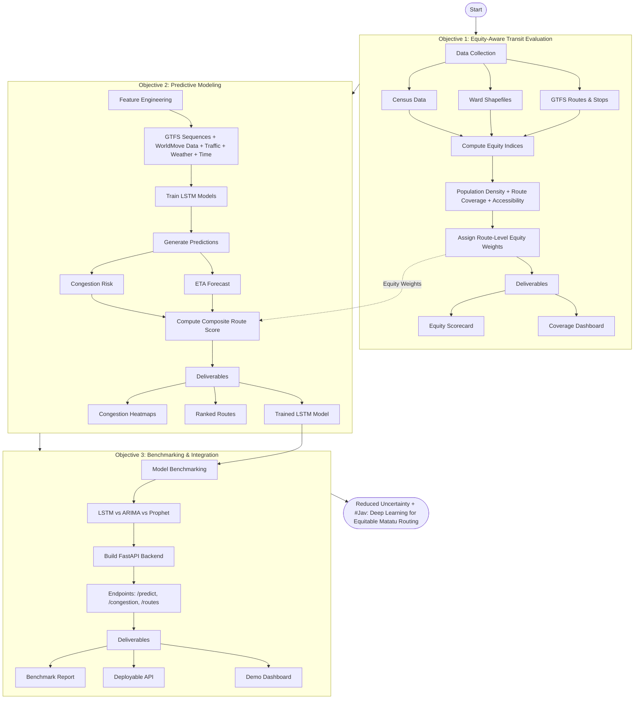

# Jav: Deep Learning for Equitable Matatu Routing in Nairobi's Informal Transit Networks

> **Jav** (shengh for *Matatu*) is a deep learning project exploring how AI can make Nairobi’s informal public transit system more **efficient**, **predictable**, and **equitable**.  
> It focuses on **ETA prediction**, **congestion mapping**, and **route performance ranking** using open transport data.

## Overview

In Nairobi, matatus serve as the dominant form of public transport, used by approximately 48–58% of daily commuters, or an estimated 1.5–3.5 million people. Despite their central role in city mobility, the system remains largely informal and uncoordinated, leading to frequent congestion, unreliable travel times, and inequitable service distribution across neighborhoods.

Equity is the core differentiator between Jav and every other ETA or transit app.
Where others optimize purely for efficiency (fastest routes, least congestion), Jav optimizes for fairness; ensuring that matatu routes serving low-income or under-served neighborhoods are not algorithmically penalized or overlooked.

**Jav** seeks to leverage **deep learning + geospatial analytics** to predict travel times (ETAs) and highlight underserved routes, improving both commuter experience and policy planning.

* **Focus**: ETA forecasting (target MAE <5 mins), congestion mapping, and route performance ranking.
* **Stack**: PyTorch/TensorFlow (DL), FastAPI (API), GeoPandas (geospatial data), and OSMnx (routing), Supabase/Postgres (DB).
* **Goal**: Reduce commuter uncertainty, time savings and identify underserved routes for more equitable urban mobility.

## Problem Statement

Nairobi’s 135+ matatu routes lack standardized schedules or predictive travel time data.  
A 10 km trip can take over **78 minutes**, especially during peak congestion in low-income areas like **Kibera** or **Pipeline**.  

While commercial transit apps exist, none integrate **machine learning-based ETA forecasts** using live data (traffic, weather, route topology) or **equity metrics** for underserved regions.

## Objectives

1. **To evaluate transit equity across Nairobi** by integrating GTFS coverage data with socio-economic and spatial datasets to identify underserved regions and generate an equity scorecard.

2. **To develop and train predictive models (LSTM-based)** to forecast ETA, congestion, and route reliability using GTFS schedules, traffic, and weather data, and compute a composite route ranking.

3. **To benchmark and deploy the system** by comparing LSTM performance against ARIMA and Prophet baselines, and build a FastAPI backend exposing predictions and rankings through a documented, Dockerized API.

## File Structure

```
.
├── data
│   ├── raw/                        # Raw downloads (GTFS, CSVs, PBF)
│   └── processed/                  # Cleaned tensors/CSVs (e.g., seqs.parquet)
│
├── notebooks/                      # Jupyter notebooks for EDA, training
│   ├── 01_gtfs_eda.ipynb           # Parse GTFS & explore stop sequences
│   ├── 02_feature_engineering.ipynb# Merge traffic & weather features
│   └── 03_model_lstm.ipynb         # LSTM training + evaluation
│
├── scripts/
│   ├── fetch_gtfs.py               # Download Digital Matatus GTFS
│   ├── preprocess_data.py          # Clean & prepare route/traffic/weather
│   └── train_model.py              # Script-based model training
│
├── server/                         # Placeholder for FastAPI backend (later phase)
│   └── app/
│       └── main.py                 # (Future) endpoints /routes, /predict
│
├── docs/
│   ├── proposal.md                 # White paper
│   ├── architecture.md             # Methodology, system design
│   └── results.md                  # Performance metrics, bias audit
│
├── requirements.txt
├── README.md
└── .gitignore
```

## Data Sources

| Source | Description | Format |
|--------|--------------|---------|
| [Digital Matatus GTFS](https://digitalmatatus.com/data) | Route, stop, and shape data | GTFS (TXT) |
| [WorldMove website](https://fi.ee.tsinghua.edu.cn/worldmove/data) | Large-scale synthetic mobility dataset | ASSORTED |
| [OpenWeatherMap API](https://openweathermap.org/history) | Weather features | JSON |
| [OpenStreetMap (Geofabrik Kenya)](https://download.geofabrik.de/africa/kenya.html) | Road network topology | PBF |


## Methodology

### **Objective 1: Equity-Aware Transit Evaluation**

**Foundation:** Ensure fair and inclusive transit service assessment. This will be broke down into two: `Spatial equity` and `Temporal equity`

#### a. Spatial Equity - Static Coverage Analysis

Measures _geographic access_ by computing the proportion of each ward’s area (and prorated population) within 500 m of matatu stops.  
GTFS stops are buffered, unioned into a coverage polygon, then intersected with ward shapefiles (e.g., Kenya census boundaries).

| Step                   | Description                                    | Formula                                   | GeoPandas Implementation                                        |
| ---------------------- | ---------------------------------------------- | ----------------------------------------- | --------------------------------------------------------------- |
| 1 Stops - Points       | Convert GTFS stops to points (EPSG 4326).      | `Point(stop_lon, stop_lat)`               | `gpd.points_from_xy(stops.stop_lon, stops.stop_lat)`            |
| 2 Buffer Service Areas | Project to UTM 37S (EPSG 32737); buffer 500 m. | `Buffer(point_i, 500)`                    | `stops_proj.buffer(500)`                                        |
| 3 Union Coverage       | Dissolve buffers into single polygon.          | `coverage_union = ⋃ buffer_i`             | `all_service_areas_gdf.dissolve()`                              |
| 4 Intersect with Wards | Compute overlap areas (m²).                    | `A_intersect,j = Area(ward_j ∩ union)`    | `wards_proj.intersection(coverage_union_proj.union_all()).area` |
| 5 Coverage Ratio       | Fraction of ward area covered.                 | `r_coverage,j = A_intersect,j / A_ward,j` | `.fillna(0).clip(0,1)`                                          |
| 6 Population Served    | Prorate by population density.                 | `P_served,j = P_j × r_coverage,j`         | `population * coverage_ratio`                                   |
| 7 Equity Index         | Ward-level Gini of % access.                   | `Gini = Σ                                 | %_access,j − %_access,k                                         |

**Inputs:** Digital Matatus GTFS stops + Kenya ward shapefiles  
**Outputs:** Ward-level scorecard (target Gini ≥ 0.7) and Folium choropleth (% access)  
**Equity Weight:**  
`w_equity,route = 1 − Σ r_coverage,j / (stops in route)` → higher for underserved routes

#### b. Temporal Equity — Dynamic Service Availability

Extends spatial coverage into _time-varying access_ using GTFS hourly frequencies from `stop_times.txt` to compute per-capita service levels by ward/hour—revealing peak/off-peak inequities.

|Step|Description|Formula|Implementation|
|---|---|---|---|
|1 Spatial Join|Assign stops to wards (point-in-polygon).|`ward_i = within(stop_i, ward_j)`|`gpd.sjoin(stops_gdf, wards_gdf, predicate='within')`|
|2 Merge with Frequencies|Link stops to hourly trips.|`trips_i,h = Σ trips_per_hour_trip,h`|`merge(on='stop_id')`|
|3 Aggregate per Ward/Hour|Sum trips and population.|`total_trips_j,h = Σ trips_i,h`|`groupby(['ward','hour']).agg(...)`|
|4 Per-Capita Service|Trips per person per hour.|`s_j,h = total_trips_j,h / P_j`|`trips_per_hour / population`|
|5 Temporal Equity Index|Gini or CV of service over time.|`Temporal_Gini_j = Gini({ s_j,h|h=0…23 })`|

**Inputs:** GTFS `stop_times.txt` + frequency tables  
**Outputs:** Hourly service heatmaps and temporal scorecards (target avg `s_j,h ≥ 2 trips/person/hour`)  
**Equity Weight Extension:**  
`w_equity,route,t = 1 − min_h (s_j,h)` → penalize routes with temporal gaps

Here’s a clean, **Markdown-readable** and properly formatted version of your objective — equations included, fully GitHub-safe and visually neat for README use:

---

### **Objective 2 — Predictive Modeling for ETA, Congestion & Route Ranking**

**Core Engine:** Context-aware forecasting and prioritization.

After equity analysis, the outputs from **Objective 1** (e.g., spatial and temporal equity weights) flow downstream to shape the predictive modeling pipeline. The LSTM becomes **equity-aware**, meaning it doesn’t just predict travel times — it learns how reliability interacts with service fairness.

#### **Data Flow & Integration Pipeline**

1. **Input Fusion**

   * **GTFS stop sequences:** `route_id`, `stop_id`, `stop_sequence`, `arrival_time`, `departure_time`
   * Join with **WorldMove mobility data** (trajectory intensity per hour) to capture dynamic movement.
   * Merge **traffic density** (Google Maps API) and **weather data** (OpenWeather) by timestamp and location.
   * Integrate **spatial equity weights** from *Objective 1* (coverage indices and underserved scores).
   * Add **temporal equity weights** *(placeholder — service frequency gaps by time-of-day or weekday/weekend)*.

2. **Feature Engineering**
   Encode **time-series sequences** per route-day as tensors:

   ```math
   X_t = [GTFS_t, Mobility_t, Traffic_t, Weather_t, Equity_t]
   ```

   * Normalize and window these into look-back sequences (e.g., 30–60 min windows) for the **LSTM**.
   * Define the target variable:

     ```math
     y_t = \text{Actual ETA} - \text{Scheduled ETA}
     ```

     or classify by congestion level *(low / medium / high)*.

3. **Model Training & Inference**

   * Train **LSTM models** to forecast **ETA** and **congestion risk** per route segment.
   * During inference, output predicted delays and reliability scores adjusted by the learned **equity context**.


4. **Composite Route Scoring**
   Combine three weighted components into a single route score:

   ```math
   \text{Route Score} = w_1(\text{Reliability}) + w_2(\text{Congestion Risk}) + w_3(\text{Equity Weight})
   ```

   where `w₃` ensures that improving service in historically underserved zones positively influences ranking.

5. **Visualization & Outputs**

   * Generate **heatmaps** showing predicted congestion under different conditions.
   * Produce a **ranked list of routes** balancing performance and fairness, ready for integration in **Objective 3**.

**Deliverables**

* Trained LSTM models for ETA and congestion prediction
* Equity-aware congestion forecasts
* Ranked route lists visualized in interactive dashboards

---

### **Objective 3: Benchmarking & Integration**

**Validation & Scale:** Transition from prototype to production.

* Benchmark LSTM model performance against **ARIMA** and **Prophet** baselines for accuracy and temporal stability.
* Develop a **FastAPI backend** to serve predictions, congestion forecasts, and equity-adjusted route rankings in real time.
* Integrate outputs into a **demo dashboard** for visualization and policy insight.

---


```mermaid
flowchart TD
    %% === Objective 1: Equity-Aware Transit Evaluation ===
    subgraph OBJ1[Objective 1: Equity-Aware Transit Evaluation]
        A1[Data Collection]
        A2[GTFS Routes & Stops]
        A3[Ward Shapefiles]
        A4[Census Data]
        A1 --> A2 & A3 & A4

        B1[Compute Equity Indices]
        B2[Population Density + Route Coverage + Accessibility]
        A2 & A3 & A4 --> B1
        B1 --> B2

        C1[Assign Route-Level Equity Weights]
        B2 --> C1

        D1[Deliverables]
        D2[Equity Scorecard]
        D3[Coverage Dashboard]
        C1 --> D1
        D1 --> D2 & D3
    end

    %% === Objective 2: Predictive Modeling ===
    subgraph OBJ2[Objective 2: Predictive Modeling]
        E1[Feature Engineering]
        E2[GTFS Sequences + WorldMove Data + Traffic + Weather + Time]
        E1 --> E2

        F1[Train LSTM Models]
        E2 --> F1

        G1[Generate Predictions]
        G2[ETA Forecast]
        G3[Congestion Risk]
        F1 --> G1
        G1 --> G2 & G3

        H1[Compute Composite Route Score]
        G2 & G3 --> H1
        C1 -.Equity Weights.-> H1

        I1[Deliverables]
        I2[Trained LSTM Model]
        I3[Congestion Heatmaps]
        I4[Ranked Routes]
        H1 --> I1
        I1 --> I2 & I3 & I4
    end

    %% === Objective 3: Benchmarking & Integration ===
    subgraph OBJ3[Objective 3: Benchmarking & Integration]
        J1[Model Benchmarking]
        J2[LSTM vs ARIMA vs Prophet]
        I2 --> J1
        J1 --> J2

        K1[Build FastAPI Backend]
        K2[Endpoints: /predict, /congestion, /routes]
        J2 --> K1
        K1 --> K2

        M1[Deliverables]
        M2[Benchmark Report]
        M3[Deployable API]
        M4[Demo Dashboard]
        K2 --> M1
        M1 --> M2 & M3 & M4
    end

    %% === Flow Connections ===
    Start([Start]) --> OBJ1
    OBJ1 --> OBJ2
    OBJ2 --> OBJ3
    OBJ3 --> End([Reduced Uncertainty + #Jav: Deep Learning for Equitable Matatu Routing])
```

**Deliverables:**
Benchmark report, deployable API, and interactive visualization dashboard.

### Setup

```bash
git clone git@github.com:atlonglastkibet/jav-nairobi.git
cd jav-nairobi
pip install -r requirements.txt
jupyter notebook
```

## License

MIT License – see [LICENSE](LICENSE).

## Acknowledgments

* Digital Matatus & University of Nairobi GTFS Project
* WorldMove datasets
* OpenWeatherMap & OSM for open APIs