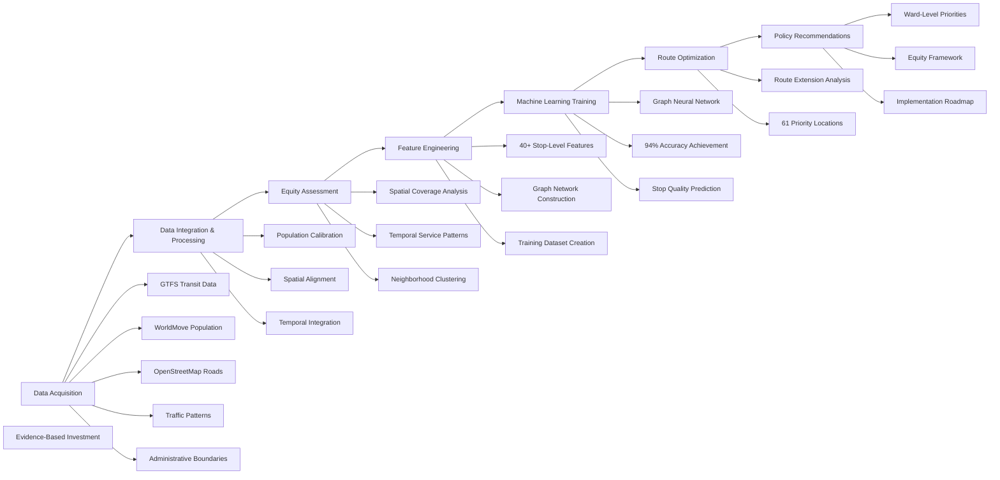
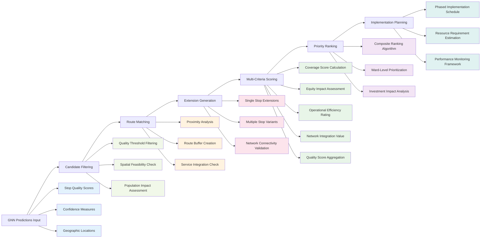

# AI-Powered Transit Equity Analysis for Nairobi

Advanced spatial machine learning and graph neural networks for evidence-based public transport planning in informal transit systems.

This project demonstrates how modern artificial intelligence can transform transit planning in developing cities by combining multiple data sources, spatial analysis, and machine learning to predict optimal locations for transit infrastructure and evaluate equity in service distribution. Using Nairobi's matatu network as a case study, the analysis provides actionable recommendations for improving public transport accessibility across diverse urban neighborhoods.

Traditional transit planning relies heavily on expert judgment and limited data analysis. This project addresses three critical challenges: identifying where to place new transit stops, understanding spatial and temporal equity in service distribution, and developing systematic approaches to network optimization that consider both ridership potential and social equity. By training machine learning models on comprehensive feature sets including population density, road connectivity, service patterns, and demographic characteristics, the system achieves 94% accuracy in predicting stop quality while maintaining explicit focus on serving underserved communities.

The methodology successfully identifies 61 high-potential locations for new transit stops and provides detailed equity analysis across Nairobi's 85 wards. The approach demonstrates significant improvements over traditional planning methods by incorporating multiple data sources, capturing spatial relationships through graph neural networks, and providing quantitative frameworks for balancing efficiency and equity objectives in transit investment decisions.

## Core Highlights and Results

**Machine Learning Performance**: Graph Neural Network achieves 94% accuracy in predicting transit stop quality with 92.5% F1 score, successfully identifying optimal locations for new infrastructure investment.

**Network Optimization Impact**: Analysis identifies 61 high-potential candidate locations for new stops, with route extension recommendations for existing services that could improve coverage in underserved areas.

**Equity Analysis Outcomes**: Comprehensive spatial and temporal equity assessment reveals significant disparities (Gini coefficient 0.35-0.57) with targeted recommendations for achieving more equitable service distribution across diverse neighborhoods.

**Data Integration Achievement**: Successfully combines five major datasets including GTFS transit data, WorldMove population estimates, OpenStreetMap road networks, traffic patterns, and administrative boundaries into unified analysis framework.

**Policy Implementation Ready**: Delivers actionable recommendations with specific ward-level priorities, route extension proposals, and quantitative frameworks for ongoing equity monitoring and investment prioritization.

## End-to-End Project Pipeline Overview



## Methodology and Architecture

The project implements a comprehensive data science pipeline that transforms raw urban data into actionable transit planning insights. Data ingestion begins with processing Digital Matatus GTFS feeds containing 136 routes and 4,284 stops, WorldMove synthetic population data calibrated to 4.8 million residents, and OpenStreetMap road networks providing connectivity analysis. This diverse data foundation undergoes careful spatial alignment and temporal integration to create consistent analytical frameworks.

Equity assessment combines spatial accessibility analysis measuring walking-distance coverage with temporal service pattern evaluation across morning, midday, and evening periods. The analysis applies Gini coefficient calculations to quantify service distribution inequality and employs k-means clustering to identify four distinct neighborhood types requiring different planning approaches. Advanced clustering techniques reveal patterns in both spatial coverage and temporal service consistency across Nairobi's 85 wards.

Feature engineering creates 40+ variables per location including population catchments, road network connectivity, service frequency metrics, traffic conditions, and demographic characteristics. The process generates both positive examples from existing stops and negative samples from candidate locations, enabling supervised machine learning approaches. Graph construction connects spatially proximate locations to capture neighborhood effects and network relationships essential for realistic transit modeling.

**Technology Stack**: Python ecosystem with PyTorch Geometric for graph neural networks, GeoPandas for spatial analysis, scikit-learn for preprocessing, NetworkX for graph operations, and Folium for interactive visualization. The pipeline leverages parallel processing for large-scale spatial computations and GPU acceleration for machine learning training where available.

## Detailed Process Visualizations

### Graph Neural Network Training Process

```mermaid
graph LR
    A[Data Preprocessing] --> B[Graph Construction]
    B --> C[Model Initialization]
    C --> D[Training Loop]
    D --> E[Performance Evaluation]
    E --> F[Model Selection]

    A --> A1[Feature Standardization]:::preprocessing
    A --> A2[Missing Value Handling]:::preprocessing
    A --> A3[Category Encoding]:::preprocessing

    B --> B1[Spatial Neighbor Finding]:::graph
    B --> B2[Edge Weight Calculation]:::graph
    B --> B3[Graph Network Creation]:::graph

    C --> C1[GCN Architecture Setup]:::training
    C --> C2[Parameter Initialization]:::training
    C --> C3[Loss Function Definition]:::training

    D --> D1[Forward Pass]:::iteration
    D --> D2[Loss Calculation]:::iteration
    D --> D3[Backpropagation]:::iteration
    D --> D4[Parameter Update]:::iteration
    D1 --> D2
    D2 --> D3
    D3 --> D4
    D4 --> D1

    E --> E1[Accuracy Assessment]:::evaluation
    E --> E2[F1 Score Calculation]:::evaluation
    E --> E3[Validation Performance]:::evaluation

    F --> F1[Best Model Saving]:::finalization
    F --> F2[Performance Logging]:::finalization
    F --> F3[Prediction Generation]:::finalization

    classDef preprocessing fill:#e1f5fe
    classDef graph fill:#f3e5f5
    classDef training fill:#e8f5e8
    classDef iteration fill:#fff3e0
    classDef evaluation fill:#fce4ec
    classDef finalization fill:#f1f8e9
```

### Route Extension and Optimization Process



## Data Sources and Citations

**Digital Matatus GTFS Dataset**: MIT Digital Matatus Project, comprehensive transit feed for Nairobi's informal transport system covering 136 routes and 4,284 stops. Original data collection period March 2012 to December 2020. Available from MIT Digital Matatus Project website with proper attribution required.

**WorldMove Population Data**: Tsinghua University Future Intelligence Lab synthetic mobility dataset providing 1km resolution population estimates. Original research published in ArXiv paper 2504.10506. Dataset available through FIB Lab portal with academic license for research applications.

**OpenStreetMap Road Network**: Community-contributed geographic data providing comprehensive road network coverage for Nairobi metropolitan area. Data extracted using OSMnx library with standard OpenStreetMap attribution requirements.

**Kenya Administrative Boundaries**: Ward and subcounty boundary shapefiles from Kenya National Bureau of Statistics and IEBC (Independent Electoral and Boundaries Commission). Used for demographic analysis and administrative aggregation.

**Traffic and Mobility Patterns**: Derived from WorldMove trajectory data through spatial and temporal aggregation techniques developed specifically for this analysis. Processing methodology detailed in notebook 07_worldmove_traffic_ETA.

## Quick Start and Setup

**Prerequisites**: Python 3.8+, GDAL libraries for geospatial processing, minimum 8GB RAM for full dataset processing, optional GPU support for accelerated machine learning training.

**Installation**:
```bash
git clone [repository-url]
cd jav
pip install -r requirements.txt
```

**Execution**:
```bash
python run_full_pipeline.py --config config/nairobi_analysis.yaml
```

The pipeline automatically downloads required datasets where available, processes spatial and temporal data, trains machine learning models, and generates policy recommendations with interactive visualizations.

## Project Breakdown

**01_gtfs_data**: Foundation analysis of Nairobi's transport system using Digital Matatus GTFS data, including route validation, stop distribution analysis, and service frequency assessment across 136 informal transport routes.

**02_worldmove_data**: Population data integration and calibration using WorldMove synthetic dataset, processing 20.8 million synthetic agents into calibrated 4.8 million population estimates aligned with administrative boundaries.

**03_equity_analysis_spatial**: Spatial accessibility assessment measuring transit coverage across neighborhoods, calculating coverage ratios and access percentages with Gini coefficient inequality measurement.

**04_equity_analysis_temporal**: Time-varying service analysis examining how transit availability changes throughout the day across three key periods (6 AM, 9 AM, 3 PM) with temporal equity assessment.

**03b_spatial_clustering**: Unsupervised machine learning classification of Nairobi's 85 wards into four distinct types based on population characteristics and transit service levels.

**04b_temporal_clustering**: Extended clustering analysis incorporating temporal service patterns to identify neighborhoods with different time-varying accessibility characteristics.

**06_calendar_spatial_temporal**: Integration of calendar framework with spatio-temporal data to enable longitudinal analysis and weekend service adjustments based on realistic operational patterns.

**07_worldmove_traffic_ETA**: Traffic pattern analysis using synthetic mobility trajectories to understand congestion, travel times, and service pressure across the metropolitan area.

**08_stop_level_feature_engineering**: Comprehensive feature creation process generating 40+ variables per location including population catchments, road connectivity, service metrics, and demographic characteristics.

**09_stop_level_feature_cleaning**: Data preprocessing and quality assurance including missing value imputation, categorical encoding, outlier treatment, and feature standardization for machine learning applications.

**10_gnn_training**: Graph Neural Network development and training achieving 94% accuracy in predicting transit stop quality using spatial relationships and comprehensive feature sets.

**11_route_extensions**: Practical application of machine learning predictions to route planning, generating specific extension recommendations for existing services with multi-criteria evaluation and priority ranking.

